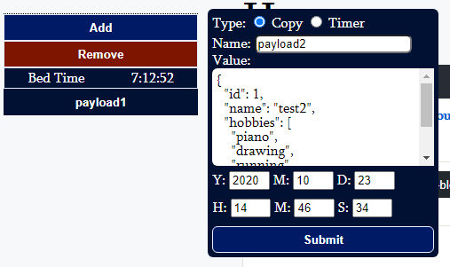

# q
This project is designed to improve work efficiency. It features a UI with the following capabilities
- Executing batch scripts at the click of a button (including passing in arguments)
- Copy content on to clipboard
- Timer for events (pop up alert when done)
- Links to saved pages

## Quick Clipboard
Quickly add copy buttons or timers.  Can be quickly deleted as well.

## Copy blocks
Displays content that would be copied to clipboard. 

## Read/Write files
Form for reading and writing to files.  Files must be deleted manually at the moment.  Shift+Enter (for adding new lines) must be used to avoid adding hidden divs to content.
- Ascending/Descending Sort
- Splitting into seperate Lines by delimiter
- Copy content of file to clipboard
- Validate JSON format

