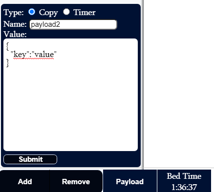

# q
This project is designed to improve work efficiency. It features a UI with the following capabilities
- Executing batch scripts at the click of a button (including passing in arguments) 
  Note scripts can either 'detach' (will not block UI but will autoclose terminal when finished), 'block' (will block UI but will not autoclose terminal), or will not open up terminal.
- Copy content on to clipboard
- Timer for events (pop up alert when done)
- Links to saved pages

## Testing
- For quick javascript coding/testing use 'q.js' at the base of the app and run 'node q.js' to execute. Not meant for saving. 
- For quick testing of html,css,javascript use index.html with liveserver in testing folder.
- For TDD with new functions or performance testing use main.js 

## Home
### Quick Clipboard
Quickly add copy buttons or timers.  Can be quickly deleted as well.




### Read/Write files
Form for reading and writing to files.  Files must be deleted manually at the moment.  
- Ascending/Descending Sort
- Splitting into seperate Lines by delimiter
- Copy content of file to clipboard
- Validate JSON format
- Find/Replace string
**Copy and paste content into notepad++ first in order to get rid of formatting**


### Clipboard
Page to store executable commands, lists, favorite links, etc. This page is dynamically created using the below format as example.
The type can be link, timer, copy, command, or group where you can have multiple of the previous. Timer must have value that uses Javascript Date constructor format.
Command can be 'block' for pop up terminal or any other string for no terminal.
```
{
  "sectionTitle": 'optional title here',
  "sectionData": [
    {
      "listTitle": "list title here",
      "listId": "list-id-here",
      "listData": [
        {
          "type": "group",
          "value": [
            {
              "type": "link",
              "label": "cjamiev/playground",
              "value": "https://github.com/cjamiev/playground"
            },
            {
              "type": "copy",
              "label": "User Name",
              "value": "user1"
            },
            {
              "type": "copy",
              "label": "Password",
              "value": "password1"
            }
          ]
        },
        {
          "type": "timer",
          "label": "35th Bday",
          "value": "2023,2,18,0,0,0"
        },
        {
          "type": "command",
          "label": "find port",
          "value": {
            "mode": "simple",
            "name": "find-port.bat",
            "argsId": "find-port-args"
          }
        
      ]
    }
  ]
}
```


### Calendar
This page is used to store log numerical data for the month such as running miles or expenses.


### Snippets
This page is used to store commonly used html tags, javascript functions, css and other code snippets.


### Mock Server
These pages can be used to create custom mock endpoints.
- Create a mock end point
- View mock end point details (update and delete)
- View and update config for adding delay, overriding urls. 
- Log of all end points hitting of this server and payloads send. 


### API Testing
This page is used to test api calls.

## Notes
You can add the following to another project while this project is running to record api calls:

```
post: (filename, content) => {
    return fetch('http://localhost:999/write', {
      headers: {
        'Accept': 'application/json',
        'Content-Type': 'application/json'
      },
      body: JSON.stringify({ filename, content }),
      method: 'POST',
      crossDomain: true
    })
      .then(resp => resp.json())
      .catch(error => console.log('error:', error));
  }
```

Content should have the following structure
```
{
  request: {
    url: '/test',
    method: 'POST'
  },
  response: {
    headers: {
      'Accept': 'application/json',
      'Content-Type': 'application/json'
    },
    status: 200,
    body: {
      test: 'testing post'
    },
    conditionalResponse: [
      {
        payload: {
          key: 'condition'
        },
        body: {
          test: 'testing conditional post'
        }
      }
    ]
  }
}
```

For autonaming filename use
```
const cleanedUrl = content.request.url.replace(/[<>://\\|?*]/g,'-');
const urlError = content.request.url ? '' : URL_ERROR;
const filename = name ? name : `${content.request.method}-${cleanedUrl}.json`;
```