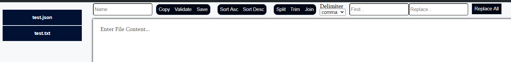

# q
This project is designed to improve work efficiency. It features a UI with the following capabilities
- Executing batch scripts at the click of a button (including passing in arguments) 
  Note scripts can either 'detach' (will not block UI but will autoclose terminal when finished), 'block' (will block UI but will not autoclose terminal), or will not open up terminal.
- Copy content on to clipboard
- Timer for events (pop up alert when done)
- Links to saved pages

## Testing
- For quick javascript coding/testing use 'q.js' at the base of the app and run 'node q.js' to execute. Not meant for saving. 
- For quick testing of html,css,javascript use index.html with liveserver in testing folder.
- For TDD with new functions or performance testing use main.js 
- For custom server end points with mock responses including conditional responses for post calls use mockResponses.js 

## Home
### Quick Clipboard
Quickly add copy buttons or timers.  Can be quickly deleted as well.


### Read/Write files
Form for reading and writing to files.  Files must be deleted manually at the moment.  
- Ascending/Descending Sort
- Splitting into seperate Lines by delimiter
- Copy content of file to clipboard
- Validate JSON format

**Note there is a wierd bug where sometimes formatting code gets into content depending on how content was added in. Double check in notepadd++ when copy/pasting**



## Snippets
This page is used to store commonly used html tags, javascript functions, css and other code snippets

## Clipboard
Page to store executable commands, lists, favorite links, etc. 


## New
Template page for adding in new pages. 

## Notes
You can add the following to another project while this project is running to record api calls:

```
post: (filename, payload) => {
    return fetch('http://localhost:999/write', {
      headers: {
        'Accept': 'application/json',
        'Content-Type': 'application/json'
      },
      body: JSON.stringify({ filename, content:payload}),
      method: 'POST',
      crossDomain: true
    })
      .then(resp => resp.json())
      .catch(error => console.log('error:', error));
  }
```

Future Features
- API Testing
- UI for mock server and updating without restarting
- Configuration based operations and more javascript generated HTML
- SVGs icons
- Format button for Read/Write files